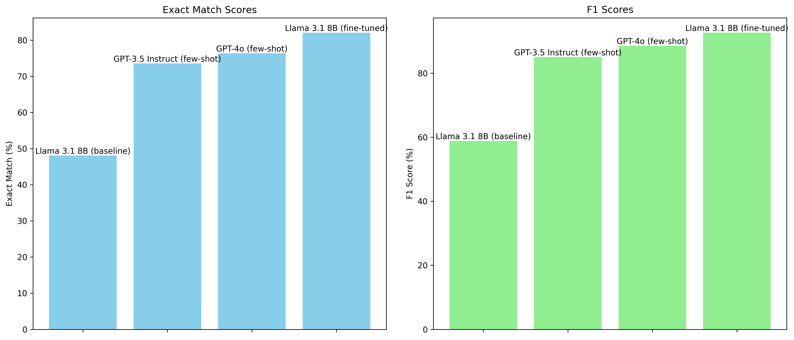
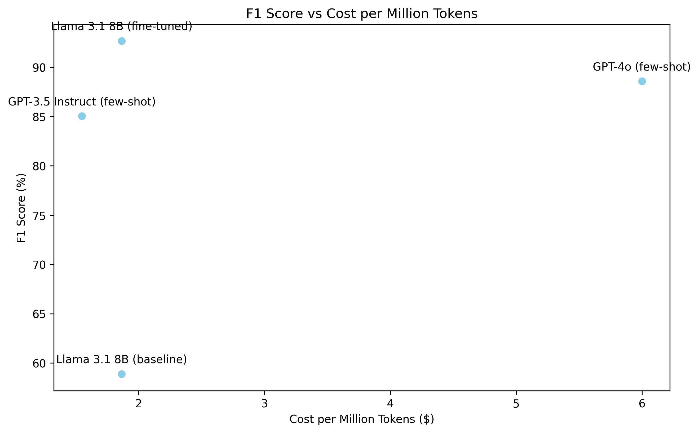

# CastAI AI Optimizer Tech Exercises

## Homework Assignment Report

### File Contents

- **compare.py**: Contains the code to compare the performance of all models
- **Nikola_Rahman_CastAI_Take_Home_Assignment.ipynb**: Jupyter notebook containing the implementation of the assignment.
- **gpt_predict.py**: Contains the code to run predictions on OpenAI models
- **predictions_baseline_zero_shot.pickle**: Contains the predictions of the baseline zero-shot model
- **predictions_finetuned.pickle**: Contains the predictions of the fine-tuned model
- **predictions_openai_gpt35.pickle**: Contains the predictions of the OpenAI GPT-3.5 Instruct model
- **predictions_openai_gpt40.pickle**: Contains the predictions of the OpenAI GPT-4.0 model
- **trainer_stats.pickle**: Contains the training statistics of the fine-tuned model

### Objective

The objective of this assignment was to fine-tune an LLM to improve its performance on question-answering tasks using the SQuAD (Stanford Question Answering Dataset).
**Bonus: Make the finetuned model outperform OpenAI's GPT-3.5 and GPT-4.0 models on the same task.**

## Assignment Details

### 1. Pre-training Evaluation

**Implementation:**

The initial evaluation was performed using the `unsloth/Meta-Llama-3.1-8B` model. The subset of SQuAD validation dataset was used for this evaluation, where prompts were formatted to present a context, a question, and an expected answer.

**Reasoning:**

- We used only a subset of the SQuAD dataset because of the time and resource constraints in Google Colab.
- We used LLAMA-3.1-8B as the base model because it can fit into a T4 GPU on Google Colab and is a good use case for efficient fine-tuning.

**Results:**

Without spending much time on prompt optimization, we achieved the following baseline results:

Baseline Results:
- Exact Match: 48.11%
- F1 Score: 58.87%

### Additional Evaluation with OpenAI Models

In addition to fine-tuning the `unsloth/Meta-Llama-3.1-8B` model, we also evaluated the performance of OpenAI's GPT-3.5 and GPT-4 models on the same SQuAD validation subset. We imagine that this would be a very common use case for `Cast.ai` customers and wanted to provide a comparison. We did some minor prompt optimization get good performance from OpenAI models via few-shot prompting.

**Results for OpenAI GPT-3.5:**
- Exact Match: 73.58%
- F1 Score: 85.04%

**Results for OpenAI GPT-4.0:**
- Exact Match: 76.42%
- F1 Score: 88.58%

### 2. Fine-Tuning the Language Model

**Implementation:**

We fine-tuned the LLM using LoRA (Low-Rank Adaptation) method of rank 32.
Reasoning: LoRA is a computationally efficient method for fine-tuning large language models, and rank 32 yields about 80M trainable parameters which can fit into a T4 GPU.

We used Unsloth library to increase the model training speed and memory efficiency.

### 3. Post-training Evaluation

**Implementation:**

We finetuned the model for 1 epoch on 4% of the SQuAD dataset and evaluated it on the validation set subset.
Reasoning: We used a small subset of the dataset to balance performance improvements with practical constraints.

**Results:**

Fine-tuned Results:
- Exact Match: 82.08%
- F1 Score: 92.66%

## Comparison of Results

Below is a table comparing the performance of the baseline zero-shot model, the fine-tuned model, and OpenAI's GPT-3.5 and GPT-4.0 models on the SQuAD validation subset:

| Model                  | Exact Match (%) | F1 Score (%) |
|------------------------|-----------------|--------------|
| Baseline Zero-Shot LLAMA 3.1 8B      | 48.11           | 58.87        |
| OpenAI GPT-3.5          | 73.58           | 85.04        |
| OpenAI GPT-4.0          | 76.42           | 88.58        |
| Fine-tuned LLAMA 3.1 8B              | 82.08           | 92.66        |

# 

From these results we can see that the fine-tuned model outperformed both the baseline zero-shot model and the OpenAI models in both exact match and F1 score.

Further inspection of accuracy vs number of input tokens shows that the fine-tuned model improvement is robust across different input lengths and especially beats the OpenAI models in the 0-50 token range.

Since we as Cast.ai have a mission to reduce costs for our customers we add a cost vs accuracy plot to show the cost effectiveness of the fine-tuned model compared to the OpenAI models. Assuming that we can achieve 10 tokens per second on a `t4g.large` instance (8GB RAM) that costs $0.0672 per hour, we can see that the fine-tuned model is more cost effective than the gpt-4o model with higher accuracy and comparable in terms of cost to the gpt-3.5 model with significantly higher accuracy. In order to compute the cost of OpenAI models we estimate that 90% of tokens are input tokens and 10% are output tokens from the SQuAD dataset.

# 

## Key Findings

- The fine-tuned `unsloth/Meta-Llama-3.1-8B` model showed a significant improvement in both exact match and F1 scores compared to the baseline zero-shot model.
- The fine-tuned model outperformed the OpenAI GPT-3.5 and GPT-4.0 models in both metrics.
- The most significant improvements were observed in the 0-50 token range, where the fine-tuned model showed a clear advantage over the OpenAI models. The fine-tuned model also demonstrated robust performance across all input lengths.
- The fine-tuned model was more cost-effective than the OpenAI GPT-4.0 model and comparable in cost to the GPT-3.5 model, while achieving higher accuracy.
- The fine-tuned model has better privacy and security guarantees compared to OpenAI models, making it a more suitable choice for sensitive data applications.

## Challenges Encountered

- Benchmarking LLM tokens per second would require a more detailed analysis of the model's performance on different hardware configurations. This information would be crucial for a more accurate cost comparison with OpenAI models. What is crucial is to ensure that the model is cost-effective for our customers by optimizing the model using for example llama.cpp or vLLM and choosing the right hardware or instance type.
- Limited compute resources on Google Colab required us to use a subset of the SQuAD dataset for both training and evaluation. This approach allowed us to balance performance improvements with practical constraints.
